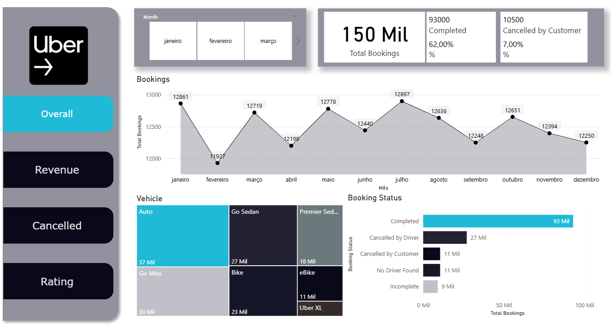
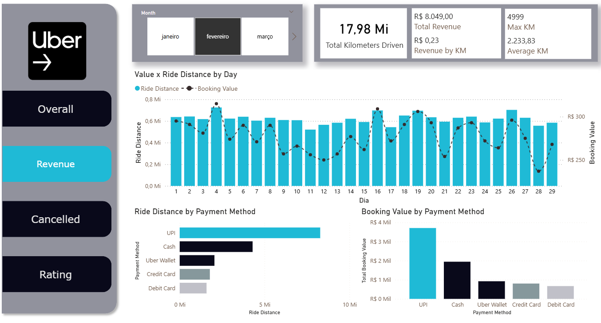
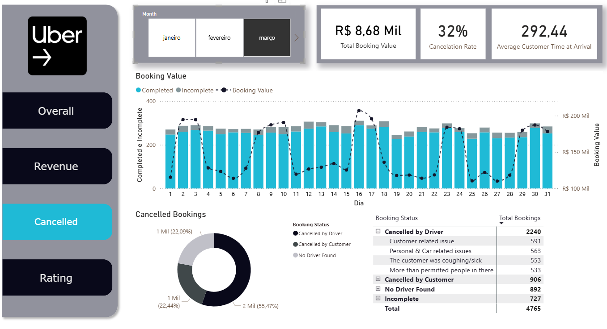
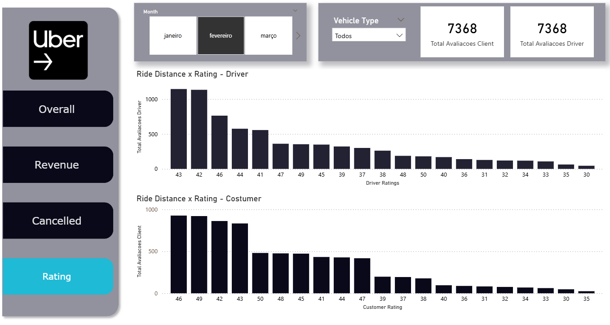

# 🚖 Dashboard de Corridas Uber – Power BI

## 📌 Sobre o Projeto
Este projeto consiste na criação de um **dashboard interativo no Power BI** utilizando um dataset fictício de corridas da Uber.  
O objetivo é demonstrar habilidades em **ETL (Extração, Transformação e Carga de dados)**, **modelagem de dados**, **criação de medidas DAX** e **visualização de dados**.

## 🗂️ Dados Utilizados
O dataset contém as seguintes colunas principais:

- **Date** – Data da corrida  
- **Time** – Horário da corrida  
- **Booking ID** – Identificador único da corrida  
- **Booking Status** – Status da corrida (Concluída, Cancelada etc.)  
- **Costumer ID** – Identificador único do cliente  
- **Vehicle Type** – Tipo de veículo utilizado  
- **Pick Up Location** – Local de embarque  
- **Drop Location** – Local de desembarque  
- **Avg Vtat** – Average Vehicle Time at Arrival (tempo médio do veículo até o cliente)  
- **Avg Ctat** – Average Customer Time at Arrival (tempo médio do cliente até o veículo)  
- **Cancelled Rides by Customer** – Cancelamentos feitos pelo cliente  
- **Reason for cancelling by Customer** – Motivo do cancelamento pelo cliente  
- **Cancelled Rides by Driver** – Cancelamentos feitos pelo motorista  
- **Driver Cancellation Reason** – Motivo do cancelamento pelo motorista  
- **Incomplete Rides / Reason** – Corridas não concluídas e motivos  
- **Booking Value** – Valor da corrida  
- **Ride Distance** – Distância percorrida  
- **Driver Ratings** – Avaliação do motorista  
- **Customer Rating** – Avaliação do cliente  
- **Payment Method** – Forma de pagamento  
- **Motivo Cancelamento** – Razão consolidada de cancelamento  

## 📊 Estrutura do Dashboard
O dashboard foi desenvolvido em **4 abas principais**:

1. **Overall** – Visão geral das corridas  
2. **Revenue** – Análise de receita e valor das corridas  
3. **Cancelled** – Cancelamentos e motivos associados  
4. **Rating** – Avaliações de motoristas e clientes  

## 🛠️ Ferramentas Utilizadas
- **Power BI** para visualização e modelagem de dados  
- **Power Query** para transformação dos dados  
- **DAX (Data Analysis Expressions)** para medidas e cálculos  
- **Excel/CSV** como fonte de dados (dataset fictício)  

## 📸 Demonstração
Aqui estão algumas capturas de tela do dashboard:

  
  
  
  

## 🚀 Como Executar
1. Baixar o arquivo `.pbix` do repositório  
2. Abrir no Power BI Desktop  
3. Explorar as abas e interações do dashboard  

## 🎯 Insights Principais
- Taxa de cancelamentos por cliente e motorista  
- Receita total e média por corrida  
- Distribuição de corridas por tipo de veículo e localização  
- Correlação entre notas de motoristas/clientes e status da corrida  

## 📌 Objetivo no Portfólio
Este projeto foi desenvolvido como parte do meu portfólio em **Ciência de Dados e Business Intelligence**, com foco em **dashboards interativos, storytelling com dados e boas práticas em visualização**.
